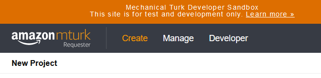
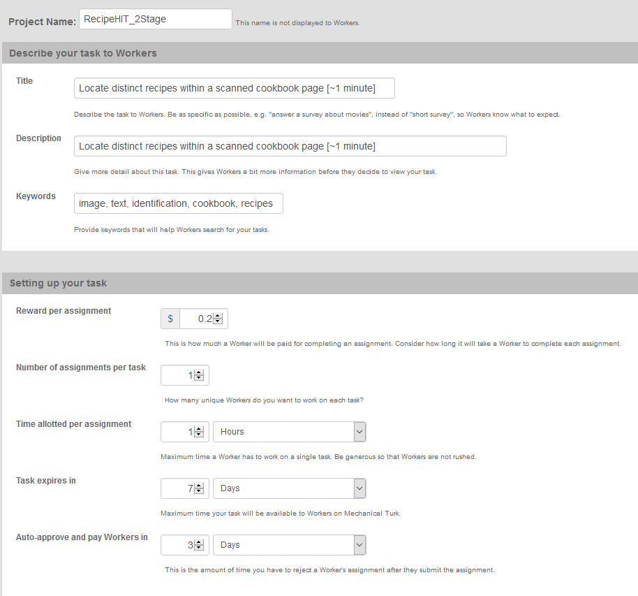
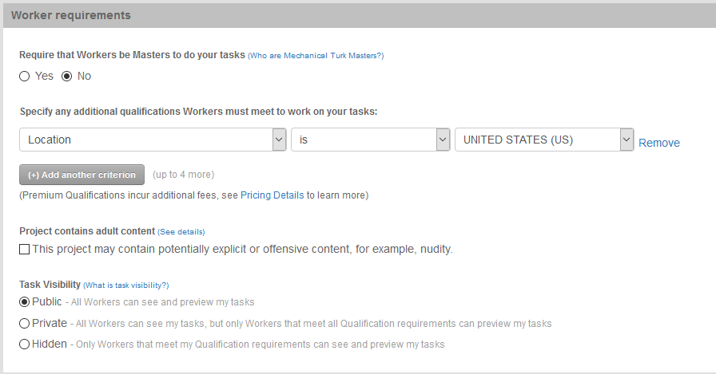

## Code for Monopsony Experiments on MTurk

This repo contains code from an image-tagging task in which workers, after completing one instance of the task, were offered a randomized wage to tag a set number of additional images. The general framework, though, should be easily adaptable to any type of HIT wherein users are offered a wage (which we pay via the "bonus" feature of the MTurk API) for additional tasks.

### Step 0: Making sure you're on the Requester Sandbox rather than the live site

For testing purposes, until the *very* end when you're sure that you're ready to launch the HITs, you should be carrying out all these steps using the Requester Sandbox at https://requestersandbox.mturk.com/, rather than the live MTurk site at https://requester.mturk.com/.

### Step 1: Create a new project

Once logged into the Requester Sandbox, click the "Create" link in the upper-left corner of the interface:



Then click "New Project", and just click the "Create Project" button at the bottom of this screen (it doesn't matter which template you choose, since we'll be overwriting the template with our custom code). Next, Enter the basic information about your task on the first tab ("Enter Properties") of the HIT creation interface. For reference, the settings used for the original recipe-image-tagging experiment are shown in the following two images:





### Step 2: Replace the default HIT design with the custom HTML and JavaScript code

The second tab of the project creation interface ("Design Layout") is where we'll replace the MTurk template design with our own code, customized based on the number of tasks you'd like each user to perform in a given session.

In our case (and in most use cases) we used Javascript to implement pagination, so that the IRB notice was on the first page, the instructions were on the second, first task on the third, additional-tasks offer on the fourth, and so on for the remaining tasks.

If your HIT only requires a few such pages, you can create them manually by modifying the `hit_page.html` file, or you can use the fancier page generator in `mturk_utils.py`. To use the page generator, run the `.py` file using the following command:

```
python 
```

The key thing in the HTML code, that allows the Javascript code to keep track of what page the worker is on, is that the content of each tab should be inside a `<div>` element with classes `ui-tabs-panel` and `ui-tabs-hide`, plus each should have an `id` attribute unique to just that page. So for example, the div containing the content of the 4th page begins and ends like so:

```html
<div class="ui-tabs-panel ui-tabs-hide" id="tabs-4">
...
</div>
```

Also note that, because each page of this particular HIT had a Javascript-rendered canvas, there is a `<script>` block at the top which just takes the HIT variables and stores them into Javascript variables:

```html
<script type="text/javascript">
var imgs = [];
imgs[1] = "${img_url1}";
imgs[2] = "${img_url2}";
imgs[3] = "${img_url3}";
...
</script>
```

You don't need to do this if your HIT doesn't require any fancy Javascript rendering -- you can just put the `${img_url1}` placeholders directly in the HTML code for each page, like

```html
<div class="ui-tabs-panel ui-tabs-hide" id="tabs-4">

</div>
<div class="ui-tabs-panel ui-tabs-hide" id="tabs-4">

</div>
<div class="ui-tabs-panel ui-tabs-hide" id="tabs-4">

</div>
```

and so on. For example, we don't use Javascript for the offer page, so that it looks like

```html
<div class="ui-tabs-panel ui-tabs-hide" id="tabs-4">
<h3>If you'd like to continue and perform ${hit_type} additional recipe location tasks for ${offer_amt}, please click "Next Page" below.</h3>

<h3>Otherwise, click the "Submit" button at the bottom of the page.</h3>

<input id="accepted-1" name="accepted-1" type="hidden" /> <a class="next-tab mover accept-offer" href="#instructions-top" id="accept-1" rel="5" title="1">Next Page &raquo;</a></div>
```

The `${hit_type}` and `${offer_amt}` placeholders in this code snippet tell MTurk that, when it's time to actually generate the individual HITs, you'll provide (upload) a `.csv` file with `hit_type` and `offer_amt` columns such that each row of the file represents one HIT that it should create, that will be removed from the HIT market as soon as a worker completes it.

### Step 3: Generating the .csv

### Step 4: Using the API to post HITs

*[Friendly reminder that you should make sure the API is set to make calls to the requester **sandbox**, not the live MTurk site, unless you have the money in your MTurk requester account and are ready to pay for the launched HITs]*

### Step 5: Approving/Rejecting Completed HITs

### Step 6: Downloading the results

### Step 7: Paying the wages using the bonus API